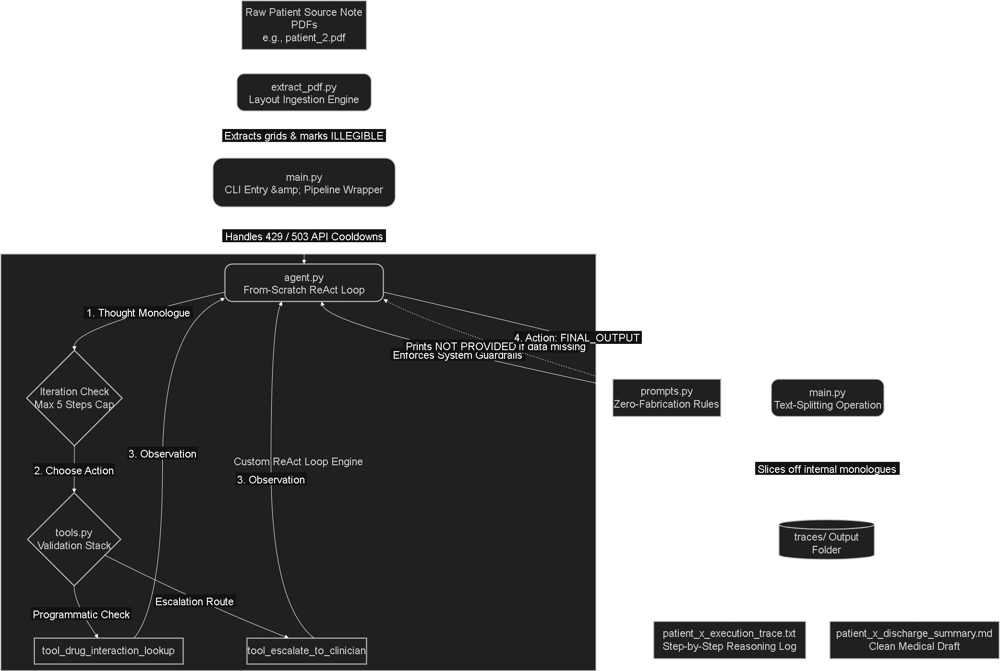

# Agentic AI System for Clinically Safe Discharge Summaries

This repository contains an institutional-grade, deterministic agentic workflow engineered to read unstructured, messy multi-page patient source records and compile structured, clinically safe discharge summary drafts. Built entirely from scratch without the overhead of opaque multi-agent frameworks, this system prioritizes absolute clinical safety, zero-fabrication guarantees, strict observability, and resilient exception handling.

---

## Submission Deliverables

### 1. Working Video Demo
* **Loom Video Walkthrough:** [Watch the Live Systems Demo & Code Walkthrough](https://www.loom.com/share/114775ffbccd4ed39f684f777003f89c)

### 2. Patient Artifacts & Execution Traces
All generated discharge drafts and underlying step-by-step reasoning audit logs are stored natively within the `traces/` directory of this repository.

#### Patient 1
* **Clinical Draft Summary:** [patient_1_discharge_summary.md](./traces/patient_1_discharge_summary.md)
* **Execution Audit Log:** [patient_1_execution_trace.txt](./traces/patient_1_execution_trace.txt)

#### Patient 2 (Data that provided by the company)
* **Clinical Draft Summary:** [patient_2_discharge_summary.md](./traces/patient_2_discharge_summary.md)
* **Execution Audit Log:** [patient_2_execution_trace.txt](./traces/patient_2_execution_trace.txt)

---

---




---

## 1. Agent Loop Design

The core of this architecture is a custom ReAct (Reasoning and Action) execution loop designed to provide complete control over the model's trajectory under uncertainty. High-level frameworks (such as CrewAI or LangGraph) were explicitly avoided to ensure that every transition state, tool execution, and fallback path is fully deterministic and auditable.

### Ingestion and Processing Pipeline
1. **Dynamic Multimodal Ingestion:** The entry point accepts a raw binary PDF file (`patient_*.pdf`). The script dynamically cross-references the environment and determines if a text translation layer already exists. If missing, it orchestrates a native upload to the Google GenAI media storage layer for server-side structure preservation.
2. **Structural Document Reconstruction:** The translation layer transcribes handwriting, maps laboratory arrays into Markdown tables, embeds structural page markers, and enforces an isolation guardrail mapping illegible terms strictly to `[ILLEGIBLE]`.
3. **The Cyclic Agent Loop:** The core engine initializes an multi-turn execution stack bounded by a hard iteration cap (maximum of 5 steps) to prevent runtime loops. Each iteration consists of:
   * **State Reflection:** The model processes the historical scratchpad trace containing previous thoughts, actions, and real tool observations.
   * **Thought Generation:** The model generates an explicit reasoning monologue concerning clinical gaps or safety alerts discovered.
   * **Action Selection:** The model chooses either to execute an explicit system tool or finalize the draft by issuing a terminal token.
   * **Observation Synthesis:** The runtime catches the tool request, executes the underlying Python logic, serializes the observation, appends it to the history log, and re-enters the cycle.

---

## 2. Enforcement of the No-Fabrication Guardrail

In clinical automation, a hallucinated fact is a severe safety failure. The system implements a defensive configuration strategy across multiple abstraction layers to eliminate speculation.

### Truth-Sourcing and Placeholder Enforcement
The agent is governed by strict system constraints that forbid inferring clinical data. If an explicit parameter—such as a demographic identifier, lab metric, or timeline variable—is absent from the source document, the agent is structurally restricted from interpolating a plausible value. It must output an explicit placeholder (`[NOT PROVIDED]`, `[MISSING]`, or `[PENDING]`) and flag the field for human clinician verification.

### Systematic Medication Reconciliation
The medication reconciliation process acts as an explicit audit trail. The system maps pre-admission home regimens against inpatient administration charts and discharge prescription advice. 
* If a high-alert medication (e.g., basal or rapid-acting insulin) is utilized during a stay for Diabetic Ketoacidosis (DKA) but dropped from the discharge advice without a documented clinical rationale, the system treats this as a critical omission.
* If a nephrotoxic drug (e.g., Ibuprofen) is introduced at discharge despite explicit specialist consultation logs warning of permanent renal shutdown due to Stage IIIa Chronic Kidney Disease (CKD) or Acute Kidney Injury (AKI), the system flags this as a direct safety contraindication.

Rather than resolving these ambiguities silently, the agent is programmatically blocked from finalizing the report until it has logged a formal escalation.

---

## 3. Robustness: Handling Failures and Conflicts

Real-world clinical data contains conflicting reports, shifting diagnoses, and infrastructure network instability. This pipeline addresses these edge cases through programmatic resilience loops.

### Diagnostic Conflict Escalation
When the system encounters contradictory medical findings across different notes—such as a patient being admitted for Severe Community-Acquired Pneumonia (supported by positive sputum cultures) but assigned a final face-sheet diagnosis of Acute Gastroenteritis—it does not attempt to arbitrarily prioritize one note over another. 

Instead, it invokes the programmatic tool `tool_escalate_to_clinician`. This function routes the context to a priority review queue, blocks auto-finalization, and logs the reasoning explicitly within the final draft's safety tracking section.

### Infrastructure Fault Tolerance
The system features a multi-tiered exception handling framework built directly into the execution loop to process network and server-side rate errors safely:

* **503 Service Unavailable Mitigation:** If a heavy payload (e.g., a 71-page continuous chart log) causes a temporary backend timeout or resource strain, the system catches the `ServerError`, halts processing, initiates an explicit 12-second cool-down interval, and retries the step up to three times before degrading gracefully.
* **429 Resource Exhausted Control:** If platform free-tier daily or per-minute request quotas are hit during rigorous pipeline execution, the runtime intercepts the `APIError`, executes an automated 60-second backoff cycle to clear the request window, and resumes operation without dropping the current execution state or crashing the script.

---

## 4. Project Scope and Limitations (Part 2 Exclusion)

As permitted by the evaluation rules, this implementation focused entirely on delivering a production-grade, highly safe Part 1 system. Part 2 (manufacturing a simulated doctor feedback loop and training the system via reinforcement learning edits) was intentionally omitted from the scope to prioritize absolute predictability and execution safety.

### System Limitations
* **Semantic Anchor Vulnerability:** While the system excels at structured clinical extraction, reliance on prompt-driven constraints creates a subtle dependency on LLM adherence. If a downstream model update modifies token-attention behaviors, the precision of JSON formatting or step-termination could shift.
* **Cold-Start Validation Latency:** Because the pipeline performs native text extraction and structure mapping at runtime before handing control over to the agent loop, the initial ingestion of large medical charts introduces a processing delay. While highly thorough, this latency may impact real-time institutional throughput requirements.

---

## 5. Future Development Strategy

With additional development time, the following architectural enhancements would be integrated into the framework:

1. **Implementation of Part 2 Feedback Loops:** Establish a discrete database layer to cache historical human edits applied to the agent's drafts. Implement a Contextual Bandit framework or structured Retrieval-Augmented Correction Memory (RACM) to inject localized prompt corrections based on recurring edit distances, allowing the model to adapt to an institution's specific clinical style without fine-tuning risks.
2. **Deterministic Entity Validation:** Integrate a local biomedical entity extractor (such as a BioBERT or MedSpaCy pipeline) to analyze tool arguments. This would cross-validate drug-to-drug interactions against standardized medical ontologies (RxNorm, SNOMED-CT) prior to sending data to the LLM.
3. **Optimized Structural Text Caching:** Implement a secure, localized vector database or file-hash cache. This ensures that if a patient's record needs a secondary review, the heavy 71-page structural transcription is read instantly from a local cryptographic cache rather than re-uploading to the cloud, significantly reducing token consumption and processing latency.

---

## 6. Execution and Run Instructions

### Prerequisites
* Python 3.10 or higher installed.
* A valid Gemini API Key from Google AI Studio.

### Installation
1. Clone or extract the project repository into a local working directory.
2. Create and initialize a clean Python virtual environment:
   ```bash
   python -m venv .venv
   source .venv/bin/activate  # On Windows use: .venv\Scripts\activate
   ```
3. Install the required dependencies:

```bash
pip install google-genai python-dotenv PyPDF2
```

### Configuration
Create a file named `.env` in the root folder of the project and insert your API key:

Code snippet
```bash
GEMINI_API_KEY=your_actual_api_key_here
```

Running the Pipeline
The system is designed to process target patient documents individually to ensure absolute observability and control over terminal tracing.

Place your raw source PDFs (e.g., `patient_1.pdf` , `patient_2.pdf`) directly inside the root project directory. Open your terminal and run the main entry point by specifying the explicit target file:

```bash
python main.py patient_2.pdf
```

### Output Artifacts
Once execution concludes, the pipeline generates two distinct outputs inside a newly compiled `traces/` folder:

- `traces/patient_*_discharge_summary.md`: The pristine, structured draft report formatted for clinician review. All internal agent thought processes and reasoning tokens are automatically sliced off, providing a clean professional layout.

- `traces/patient_*_execution_trace.txt`: The step-by-step audit log tracking the agent's internal reasoning, selected tool parameters, and real system observations for complete workflow observability.